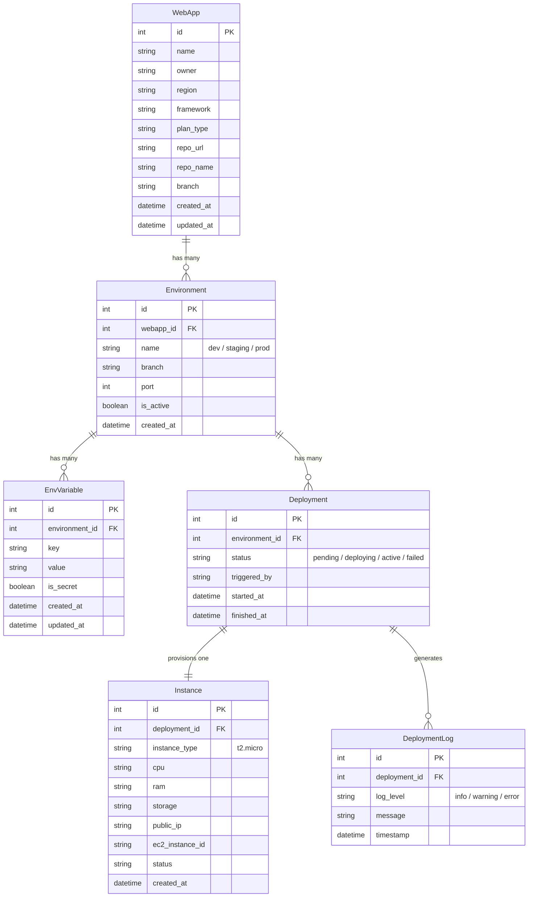

# Database Design — Thinking From Scratch

## How to Think About This (Not Cramming, Actually Thinking)

Before drawing any diagram, ask the right questions. Start with **real-world things and what happens to them**.

### Step 1: What are the real-world things?

1. A **user** creates a **web app** (name, repo, region, framework, plan)
2. Each app has an **environment** (config: port, branch, active/inactive)
3. Each environment has **env variables** (key-value pairs, some are secrets)
4. When we deploy, that's a **deployment** (an event with a status timeline)
5. Each deployment provisions an **instance** (the actual EC2 machine)
6. Each deployment generates **logs** (what happened, in order)

**That's 6 things → 6 models. Nothing more.**

### Step 2: What grows fast? (This determines if it's scalable)

| Thing | Growth rate | Design decision |
|-------|-----------|----------------|
| WebApps | Slow | Small table, no worries |
| Environments per app | Tiny (2-5) | Small table, no worries |
| Env variables | Moderate (5-20 per env) | **Own table** — not JSONField |
| Deployments | **Fast** (every re-deploy) | **Own table** — append-only, never mutate |
| Deployment logs | **Fastest** (10-50 per deploy) | **Own table** — isolated from everything else |

> **The scalability rule**: Things that grow fast get their own table. Period.

### Step 3: What queries will we run?

- "Show me all apps for user X" → `WebApp.owner` indexed
- "Show me env variables for production" → `EnvVariable.environment_id` indexed
- "Show me the latest deployment" → `Deployment.started_at` descending
- "Show me deploy logs" → `DeploymentLog.timestamp` descending, paginated

---

## The Design — 6 Models

### Relationships in plain English

```
A WebApp HAS MANY Environments (dev, staging, prod)
An Environment HAS MANY EnvVariables (one row per key-value)
An Environment HAS MANY Deployments (history of every deploy)
A Deployment HAS ONE Instance (the actual EC2 machine)
A Deployment HAS MANY DeploymentLogs (what happened)
```

### ER Diagram



---

## Why This is Scalable — 3 Reasons (interviewer answer)

### 1. Env variables are normalized (not JSONField)

| JSONField (bad) | Separate table (good) |
|---|---|
| `{"API_KEY": "abc", "DB_PASS": "xyz"}` | One row per variable |
| Can't search by key | Can index and search by key |
| Can't audit changes | `updated_at` tracks when it changed |
| All-or-nothing encryption | `is_secret` flag → encrypt only secrets |

### 2. Deployments are append-only

Each deploy = new `Deployment` row. Never mutate old ones.

- **History**: "Show me the last 10 deploys" → simple query
- **Rollback**: Previous deploy's config is still there
- **No conflicts**: Two environments deploying simultaneously = no problem

### 3. Logs are isolated

DeploymentLog is the **fastest growing** table. By keeping it separate:
- It doesn't slow down `WebApp` or `Environment` queries
- You can paginate, archive, or purge old logs independently

---

## Where Does AWS Come In?

```
User fills form → POST /api/webapps/
                       ↓
              Creates: WebApp + Environment + Deployment
                       ↓
              Background task:
                       ↓
         1. Status → "pending"
         2. boto3.run_instances()     ← AWS creates a real EC2
         3. Status → "deploying"
         4. Wait for EC2 to boot
         5. Get public_ip
         6. Status → "active"
         7. Log every step to DeploymentLog
```

All plans use `t2.micro` (Free Tier). Plan type is stored in DB for the design, but the actual EC2 is always free-tier.

---

## Django Model Reference

### WebApp
```python
name = CharField(max_length=100)
owner = CharField(max_length=100)       # GitHub username
region = CharField(max_length=50, choices=REGION_CHOICES)
framework = CharField(max_length=50, choices=FRAMEWORK_CHOICES)
plan_type = CharField(max_length=20, choices=PLAN_CHOICES)
repo_url = URLField(blank=True)
repo_name = CharField(max_length=200, blank=True)
branch = CharField(max_length=100, default='main')
created_at = DateTimeField(auto_now_add=True)
updated_at = DateTimeField(auto_now=True)
```

### Environment
```python
webapp = ForeignKey(WebApp, on_delete=CASCADE, related_name='environments')
name = CharField(max_length=50)         # "dev", "staging", "production"
branch = CharField(max_length=100, default='main')
port = IntegerField(default=3000)
is_active = BooleanField(default=True)
created_at = DateTimeField(auto_now_add=True)
```

### EnvVariable
```python
environment = ForeignKey(Environment, on_delete=CASCADE, related_name='env_variables')
key = CharField(max_length=255)
value = TextField()
is_secret = BooleanField(default=False)
created_at = DateTimeField(auto_now_add=True)
updated_at = DateTimeField(auto_now=True)
```

### Deployment
```python
environment = ForeignKey(Environment, on_delete=CASCADE, related_name='deployments')
status = CharField(max_length=20, choices=STATUS_CHOICES, default='pending')
triggered_by = CharField(max_length=100, blank=True)
started_at = DateTimeField(auto_now_add=True)
finished_at = DateTimeField(null=True, blank=True)
```

### Instance
```python
deployment = OneToOneField(Deployment, on_delete=CASCADE, related_name='instance')
instance_type = CharField(max_length=20, default='t2.micro')
cpu = CharField(max_length=20)
ram = CharField(max_length=20)
storage = CharField(max_length=20)
public_ip = GenericIPAddressField(null=True, blank=True)
ec2_instance_id = CharField(max_length=100, blank=True)
status = CharField(max_length=20, default='pending')
created_at = DateTimeField(auto_now_add=True)
```

### DeploymentLog
```python
deployment = ForeignKey(Deployment, on_delete=CASCADE, related_name='logs')
log_level = CharField(max_length=10, choices=LOG_LEVEL_CHOICES, default='info')
message = TextField()
timestamp = DateTimeField(auto_now_add=True)
```
