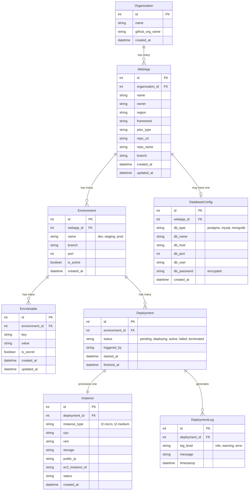

# Database Design — Thinking From Scratch

## How to Think About This (Not Cramming, Actually Thinking)

Before drawing any diagram, let's ask the right questions. This is what experienced designers do — they don't start with tables, they start with **real-world things and what happens to them**.

### Step 1: What are the real-world things?

Read the assignment again. Forget code. What **things** exist in this system?

1. A **user** creates a **web app**
2. That app lives in some **organization** on GitHub
3. The app gets deployed to a specific **region**
4. Each app can have multiple **environments** (think: dev, staging, production)
5. Each environment has **configuration** — port, env variables
6. Each environment runs on an **instance** — actual compute (EC2 machine)
7. When we deploy, stuff happens in sequence — that's a **deployment** with **logs**
8. Optionally, the app has a **database** attached

### Step 2: What changes over time? (This is where scalability thinking starts)

Ask: *"If this app is used for 2 years, what grows?"*

| Thing | Does it grow? | How fast? |
|-------|--------------|-----------|
| Users | Yes | Slowly |
| WebApps | Yes | Each user creates multiple |
| Environments per app | Yes | 2-5 per app (dev, staging, prod) |
| Instances per environment | **Yes!** | Every re-deploy creates a new one |
| Env variables | Moderate | 5-20 per environment |
| Deployment logs | **Fast!** | Every deploy generates 10-50 log lines |

> **Key insight**: The things that grow FASTEST should be in their own tables, with proper indexing, so they don't slow down everything else.

### Step 3: What questions will we ask the database?

This is the most important step. The queries determine the design.

- "Show me all apps for user X" → Need: `WebApp.owner` indexed
- "Show me the current running instance for app Y's production env" → Need: filter by environment + status
- "Show me env variables for this environment" → Need: fast lookup by environment ID
- "Show me deployment logs for this instance, newest first" → Need: indexed timestamp
- "What's the status of my latest deployment?" → Need: latest instance per environment

### Step 4: Where does my old design fall short?

The original design had:

```
WebApp → Environment (env_vars as JSONField) → Instance
```

**Problems:**

1. **`env_vars` as JSONField** — You can't search, filter, or audit individual variables. If a password changes, there's no history of what it was. The interviewer specifically cares about scalability — JSONField doesn't scale for operations like "find all apps using API_KEY=xyz".

2. **No multi-environment support** — The old design had one environment per app. Real platforms have dev/staging/prod. Each with its own config.

3. **No deployment history** — Instance was a single record that got mutated. Scalable design keeps **every deployment** as a separate record so you have history.

4. **No Organization model** — The app belongs to an org, and orgs have multiple users. Without this, you can't do team-based access.

5. **Env variables not individually encrypted** — Secrets like `DB_PASSWORD` should be flagged and handled differently.

---

## The Improved Design

### Step 5: Draw the relationships first (think in English, not SQL)

```
An Organization HAS MANY WebApps
A WebApp HAS MANY Environments (dev, staging, prod)
An Environment HAS MANY EnvVariables (individual key-value rows)
An Environment HAS MANY Deployments (history of every deploy)
A Deployment HAS ONE Instance (the actual compute)
A Deployment HAS MANY DeploymentLogs
A WebApp MAY HAVE ONE DatabaseConfig
```

### Now here's the ER Diagram:



---

## Why This Design is Scalable — The Specific Reasons

### 1. EnvVariable is its own table (not JSONField)

**Before:** `env_vars = {"API_KEY": "abc", "DB_PASS": "xyz"}` in one JSONField.

**After:** Each variable is a row.

| Why this matters for scalability |
|---|
| You can **index** by key — "find all apps using `STRIPE_KEY`" is a real query |
| You can **audit** changes — add `updated_at`, see when a secret was rotated |
| You can **encrypt selectively** — `is_secret=True` means only those get encrypted |
| You can **paginate** — 500 env vars? No problem, it's just rows |
| Django admin can edit them individually — try editing a JSONField blob |

### 2. Deployment is separate from Instance

**Before:** Instance had `status` that got mutated: pending → deploying → active.

**After:** Each deploy is a NEW `Deployment` row. The Instance is created when the deployment starts.

| Why this matters |
|---|
| **Full deployment history** — "show me the last 10 deploys" is a simple query |
| **Rollback** — You know what the previous deploy's config was |
| **No data mutation** — Append-only logs are inherently more scalable |
| **Concurrent deploys** — Two people can deploy to different environments simultaneously |

### 3. Organization as a first-class entity

| Why this matters |
|---|
| **Multi-tenancy** — Multiple users can share apps under one org |
| **Access control** — Easy to add "who can deploy to prod?" later |
| **Billing** — Bill per org, not per user |

### 4. Multiple Environments per WebApp

| Why this matters |
|---|
| **Real-world usage** — Every serious app has dev/staging/prod |
| **Independent configs** — Prod has different env vars than dev |
| **Independent deploy cycles** — Deploy to staging without touching prod |

---

## Where Does AWS Come In?

Here's the flow — this is what the interviewer means:

```
User fills form → POST /api/webapps/
                       ↓
              Backend creates WebApp + Environment + Deployment
                       ↓
              Background task starts:
                       ↓
         ┌─────────────────────────────┐
         │ 1. Status → "pending"      │
         │ 2. Call boto3.create_ec2() │  ← THIS IS THE AWS PART
         │ 3. Status → "deploying"    │
         │ 4. Wait for EC2 to start   │
         │ 5. Get public IP           │
         │ 6. Status → "active"       │
         │ 7. Log everything          │
         └─────────────────────────────┘
```

**AWS = the actual infrastructure.** When the user picks:
- **Region:** `ap-south-1` → that's the AWS region for the EC2
- **Plan: Starter** → `t2.micro` (1 CPU, 1GB RAM)
- **Plan: Pro** → `t2.medium` (2 CPU, 4GB RAM)

The backend takes these choices and calls AWS to **actually create a virtual machine**. The `Instance` model stores the `ec2_instance_id` and `public_ip` that AWS returns.

The interviewer told you to **actually do this** (not mock it). So you'll need:
- An AWS account with access keys
- `boto3` library in Django
- Real API calls to `ec2.run_instances()`

---

## How Top System Designers Think About This

Here's the mental framework — 5 questions, in order:

### Q1: "What are the nouns?"
→ These become your models/tables

### Q2: "What verbs happen to those nouns?"
→ "App is **created**", "Environment is **deployed**", "Instance is **terminated**"
→ Verbs that have a history become their own tables (Deployment, DeploymentLog)

### Q3: "What grows without bound?"
→ Logs, deployments, env variables
→ These MUST be in separate tables, never embedded in parent records

### Q4: "What are the access patterns?"
→ "List my apps" (frequent, must be fast)
→ "Get latest deployment status" (real-time, needs indexing)
→ "Search deployment logs" (could be huge, paginate)

### Q5: "What would break if we had 1000x more data?"
→ JSONField with 500 env vars? Breaks.
→ Mutating instance status in-place? Loses history.
→ No indexes on `webapp.owner`? Full table scan.

This is the **thinking process**. Not "what framework should I use?" — but "what are the real things, what happens to them, and what questions will I ask?"

---

## Model Field Reference

For when you actually write the Django models:

### Organization
```python
name = CharField(max_length=100)
github_org_name = CharField(max_length=100, blank=True)
created_at = DateTimeField(auto_now_add=True)
```

### WebApp
```python
organization = ForeignKey(Organization, on_delete=CASCADE, related_name='webapps')
name = CharField(max_length=100)
owner = CharField(max_length=100)  # GitHub username
region = CharField(max_length=50, choices=REGION_CHOICES)
framework = CharField(max_length=50, choices=FRAMEWORK_CHOICES)
plan_type = CharField(max_length=20, choices=PLAN_CHOICES)
repo_url = URLField(blank=True)
repo_name = CharField(max_length=200, blank=True)
branch = CharField(max_length=100, default='main')
created_at = DateTimeField(auto_now_add=True)
updated_at = DateTimeField(auto_now=True)
```

### Environment
```python
webapp = ForeignKey(WebApp, on_delete=CASCADE, related_name='environments')
name = CharField(max_length=50)  # "dev", "staging", "production"
branch = CharField(max_length=100, default='main')
port = IntegerField(default=3000)
is_active = BooleanField(default=True)
created_at = DateTimeField(auto_now_add=True)
```

### EnvVariable
```python
environment = ForeignKey(Environment, on_delete=CASCADE, related_name='env_variables')
key = CharField(max_length=255)
value = TextField()
is_secret = BooleanField(default=False)
created_at = DateTimeField(auto_now_add=True)
updated_at = DateTimeField(auto_now=True)
```

### Deployment
```python
environment = ForeignKey(Environment, on_delete=CASCADE, related_name='deployments')
status = CharField(max_length=20, choices=STATUS_CHOICES, default='pending')
triggered_by = CharField(max_length=100, blank=True)
started_at = DateTimeField(auto_now_add=True)
finished_at = DateTimeField(null=True, blank=True)
```

### Instance
```python
deployment = OneToOneField(Deployment, on_delete=CASCADE, related_name='instance')
instance_type = CharField(max_length=20)  # t2.micro, t2.medium
cpu = CharField(max_length=20)
ram = CharField(max_length=20)
storage = CharField(max_length=20)
public_ip = GenericIPAddressField(null=True, blank=True)
ec2_instance_id = CharField(max_length=100, blank=True)
status = CharField(max_length=20, default='pending')
created_at = DateTimeField(auto_now_add=True)
```

### DeploymentLog
```python
deployment = ForeignKey(Deployment, on_delete=CASCADE, related_name='logs')
log_level = CharField(max_length=10, choices=LOG_LEVEL_CHOICES, default='info')
message = TextField()
timestamp = DateTimeField(auto_now_add=True)
```

### DatabaseConfig
```python
webapp = OneToOneField(WebApp, on_delete=CASCADE, related_name='database_config')
db_type = CharField(max_length=20, choices=DB_TYPE_CHOICES)
db_name = CharField(max_length=100)
db_host = CharField(max_length=255, blank=True)
db_port = IntegerField(default=5432)
db_user = CharField(max_length=100, blank=True)
db_password = CharField(max_length=255, blank=True)  # encrypt in production
created_at = DateTimeField(auto_now_add=True)
```
